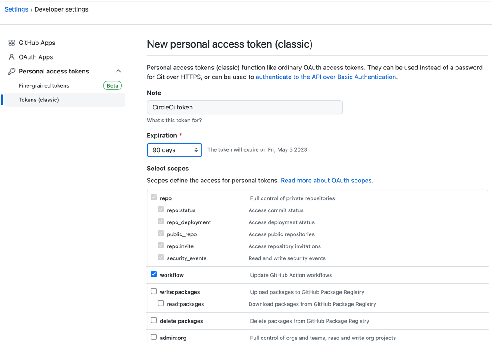

# circleci-cancel-draft

CircleCI runs build for Draft PR.

This docker image supports cancel build if PR in the `Drfat` status or has `Draft` label. 


```yaml
version: 2
jobs:
  cancel_draft_build:
    parallelism: 1
    docker:
      - image: vitalinfo/circleci-cancel-draft
        environment:
          CIRCLECI_TOKEN: ZZZZZZZZZZZ
          GITHUB_TOKEN:   XXXXXXXXXXX
    steps:
      - run: cancel-draft-build

workflows:
  version: 2
  tests:
    jobs:
      - cancel_draft_build
      - ... # other build steps
```

## Deployment

```bash
$ docker build . -t vitalinfo/circleci-cancel-draft && docker push vitalinfo/circleci-cancel-draft
```

## Tokens

### GitHub Token

1. Open [New personal access token (classic)](https://github.com/settings/tokens/new)
2. Set _Note_
3. Choose _Expiration_
4. Select _workflow_ scope

5. Click _Generate token_

### CircleCI Token

1. Open [Personal API Tokens](https://app.circleci.com/settings/user/tokens)
2. Click _Create New API Token_
3. Set _Token Name_
4. Click _Add API Token_

